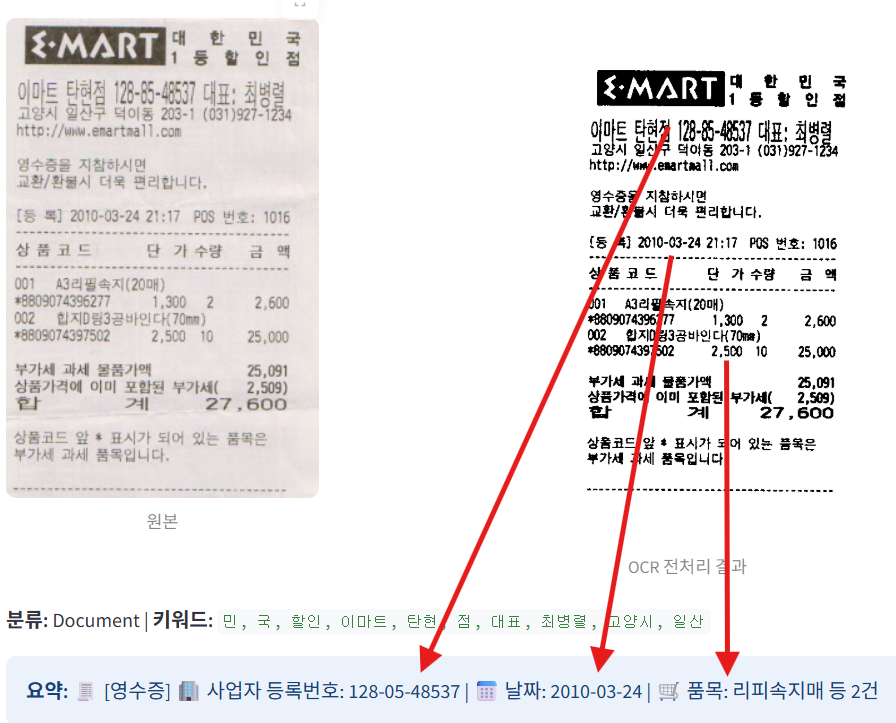
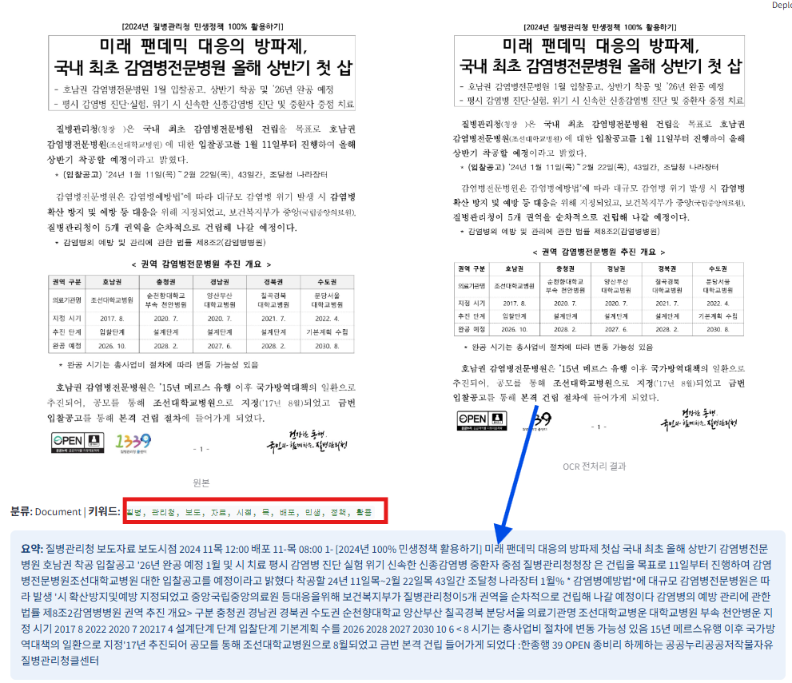
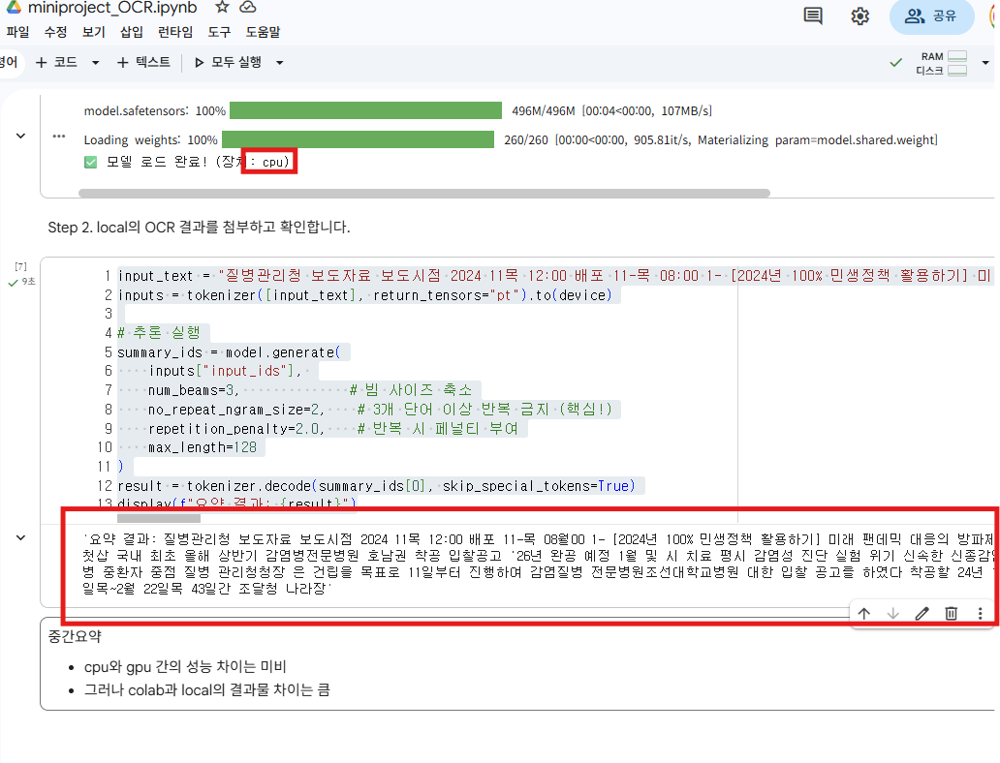

## 프로젝트 구조

```
ai-document-archive/
├── app.py                # 메인 애플리케이션
├── requirements.txt      # 패키지 목록
├── archive.db           # SQLite 데이터베이스 (자동 생성)
└── test-image.jpg       # 테스트용 샘플 이미지
```

## 프로젝트 시작

```bash
# 1. 가상환경 버전1
conda env create -f environment.yml

# 2. 애플리케이션 실행
streamlit run app.py
```

```bash
# [참고] 가상환경 버전2
# 환경 이름: app, python 버전: 3.10
conda env create -n app python=3.10 -y

# 환경 활성화
conda activate app

# 패키지 설치
pip install -r requirements.txt
```

## 사용 방법

1. http://localhost:8501 접속
2. **문서 업로드 탭**
   - PNG, JPG, JPEG 형식의 문서 이미지 업로드
   - 자동으로 문서 유형 분류 및 정보 추출
   - "저장" 버튼으로 데이터베이스에 보관
3. **문서 검색 탭**
   - 벡터 유사도 검색 또는 키워드 검색 선택
   - 검색어 입력 (예: "영수증", "계약서")
   - 검색 결과에서 이미지 미리보기 및 다운로드
4. **문서 목록 탭**
   - 저장된 모든 문서 목록 확인
   - 각 문서의 상세 정보 열람

## 주요 기능

- PaddleOCR 한국어 텍스트 추출 및 위치 검출
- Streamlit 웹 기반 사용자 인터페이스

# [핵심 기술적 성과: OCR Pipeline]

1. 슬라이딩 윈도우(Sliding Window)
   - 문제: 영수증 스캔 시, 사업자 등록번호를 물품번호에서 가져오는 문제가 발생함.
   - 행동: 이미지를 머리-배-다리 3개 영역으로 분할 판독하는 Sliding Window 알고리즘을 도입.
     - 또한,중복 탐지된 데이터는 **물리적 좌표($y, x$)**를 기준으로 단일화하여 데이터 중복을 원천 차단함.

2. 좌표 기반 문맥 재구성 (Spatial Context Reordering)
   - 문제: 기계의 탐지 순서에 따라 왼쪽을 읽다가 아래에서 읽다가 중구난방으로 해독하는 문제가 발생함.
   - 추출된 모든 텍스트 박스를 물리적 좌표에 따라 읽음. '사람'처럼 읽도록 만듦. 이를 통해 문서의 선후 관계 정합성을 확보하며 '읽기 가능한' 데이터 구조를 형성함.

# [AI 모델 운용 및 제약 사항]

1. KoBART 요약 모델의 한계
   - 자원 제약: Transformer 기반 KoBART 모델은 높은 연산량을 요구함. CPU 환경에서의 추론 지연(Latency)을 고려하여, 자원 효율성을 위해 영수증에서 직접 요약을 진행함. 이때, 필요한 데이터는 무엇인 지? 어디에서 데이터를 추출하는 지 고민함.

   - 환각 현상(Hallucination): 정렬되지 않은 OCR 데이터를 KoBART에 투입할 경우 AI가 문맥을 오해하여 가상의 정보를 생성하는 오류를 발견. 이를 방지하기 위해 **'OCR 정렬 후 요약'**이라는 선결 방향을 배움.

   - local과 colab의 차이를 발견: 같은 cpu 아래에서 라이브러리 버전이 달라 출력물이 다름. 따라서, ai 모델 관련해서는 colab에서 진행할 예정임.

   - [중요] 향후 진행방향: 1. colab에서 작업한 폴더를 Google Drive에 올린다. - 2. ai 서버에서 모델(폴더)을 불러온다. 이때, Docker가 필요함.
   - 왜? colab에서 라이브러리 버전 꽉 잡기 위함임. (숲으로 돌아가는 것을 방지)



# 배운점:

1. 이미지 전처리 </br>
   - LANCZOS4 보간법을 이용한 2배 확대 및 Otsu 이진화를 통해 인식률을 향상함.

2. 데이터 추출 기법: 하이브리드
   - 정형 데이터: 날짜, 전화번호, 금액 등은 **Regex(정규표현식)**를 통해 엄격하게 정제.
   - 비정형 데이터: 품목명 등은 문맥 기반 영역 추출(Context-Aware) 로직을 통해 유연하게 확보.
3. 디버깅:
   - [DEBUG] 프린트를 통해 원시 데이터를 확인하며 근본 원인을 파악하고 보완함.
